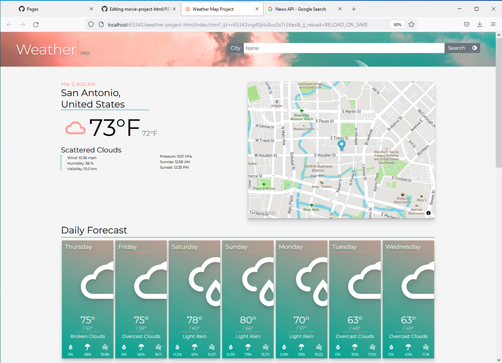
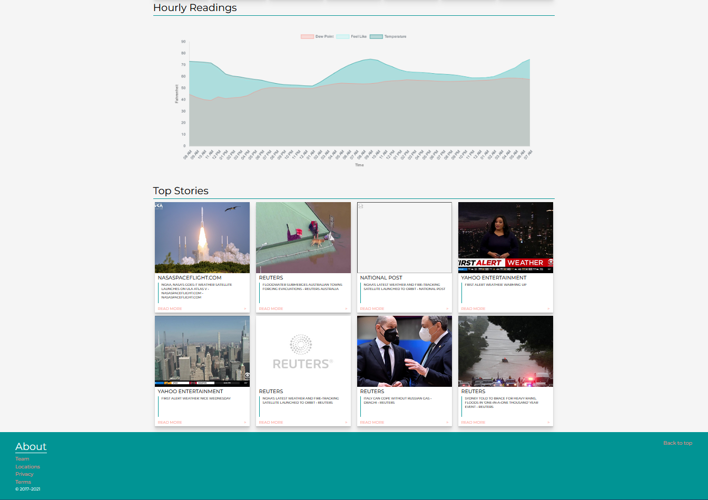
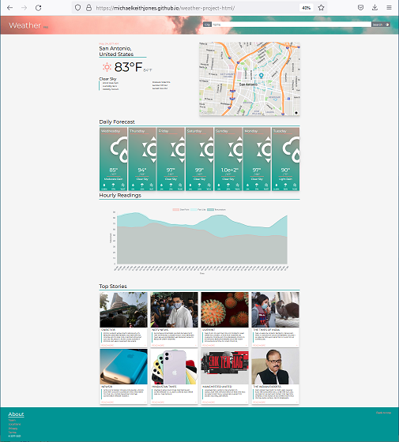
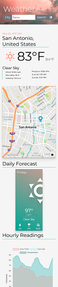

## Summary

**The Weather Project** allows users to view a 7-day forecast for the city of their choice. Users can drop a pin on a map or use a searchbar to find a location. The application also gives hourly weather readings and displays top weather related news stories. This was done using HTML5, CSS, jQuery, Ajax, Chart.js, the Mapbox API, the OpenWeatherMap API and the News API.

Github Page: https://michaelkeithjones.github.io/weather-project-html/

Page Top

Page Bottom

## Responsive Design

The application resizes and adjust elements relative to the width of the viewing device as seen below:

    
    

*Desktop / Mobile*

## To Do

- Add Celsius temperature switch/button
- Add touch capability to mobile screen size.

## External Dependencies

- **News API**: https://newsapi.org/
- **OpenWeather API**: https://openweathermap.org/
- **Mapbox API**: https://www.mapbox.com/
- **Font Awesome 4.7**: https://fontawesome.com/v4/examples/
- **Google Fonts**: https://fonts.google.com/specimen/Montserrat
- **jQuery**: https://jquery.com/
- **Chart.js** https://www.chartjs.org/

## Background

The above project was an assignment given by the CodeUp Full Stack Web Developers Course. This course is a fully-immersive, project-based, and intensive 22-week Full-Stack Java Career Accelerator that provides students with 670 hours of expert instruction in software development: https://codeup.com/program/full-stack-web-development/

### Application Minimum Requirements:

- Create a new HTML file called weather_map.html.
- As you complete each step, commit your changes and push them to GitHub.
- Using HTML, CSS, jQuery, AJAX, and the OpenWeatherMap API, start by showing the current conditions for city you live in on your page.
- Update your layout and AJAX request(s) to display a five day forecast for the city you live in that looks like the screenshot below.
- If you want to add the icons the URLs for OpenWeatherMap's icons are formatted like: http://openweathermap.org/img/w/[icon].png where [icon] comes from the API response.
- Refer to your Mapbox API exercise. Recreate the map below your 5 day forecast. Read through the documentation for the Mapbox API and figure out how to allow the user to drop a pin on any place on the map. Once the user drops a pin, grab its coordinates and feed those into your OpenWeatherMap API. Update the five-day forecast with the information from those coordinates (you should also get rid of your input boxes at this point).
- Add a Mapbox text input to search by location and have the forecast update when a new location is searched.
- **Bonus**: As a bonus make sure you can update the marker's position to the new search result.

